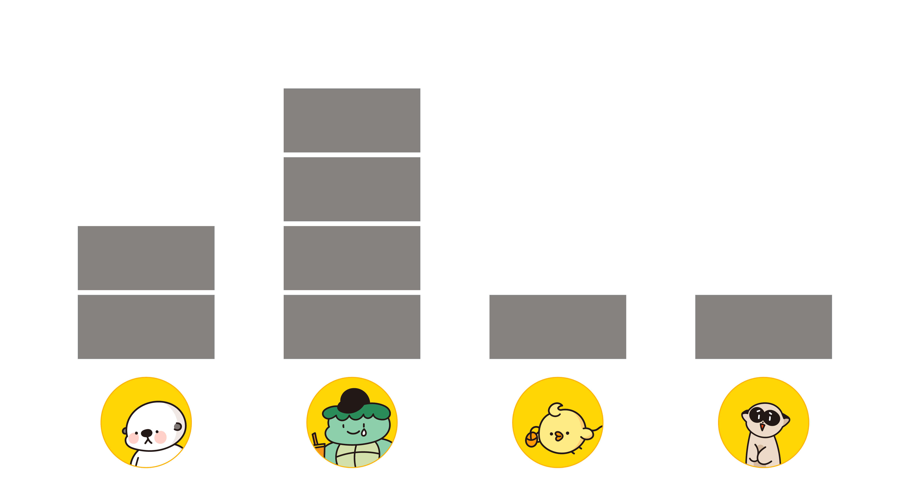
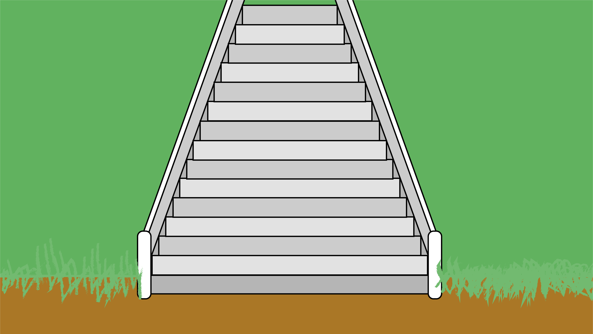

# Background-배경 이미지

**Background Folder Guide - 배경 이미지 폴더 사용법**

We provide an background images.

All image names have the following rules.

- `Background_(character name)_(characteristic)_(file number)`

배경 이미지를 제공합니다.

모든 이미지 이름은 다음의 규칙을 가집니다.

- `Background_캐릭터명_infor_번호`

### Image List (이미지 한눈에 보기)

---

[Background_none_graph_0.png](./Background_none_graph_0.png)

[Background_none_livingroom_0.png](./Background_none_livingroom_0.png)

[Background_none_nature_0.png](./Background_none_nature_0.png)

[Background_none_rainforest_0.png](./Background_none_rainforest_0.png)

[Background_none_river_0.png](./Background_none_river_0.png)

[Background_none_stair_0.png](./Background_none_stair_0.png)

[Background_none_village_0.jpg](./Background_none_village_0.jpg)

[Background_none_water_0.jpg](./Background_none_water_0.jpg)

[Background_none_water_1.png](./Background_none_water_1.png)

[Background_none_water_2.png](./Background_none_water_2.png)

---

### Using HaedalFriends

[HaedalFriends Opensource Guide](../README.md)

[해달프렌즈 오픈소스 가이드](../README.md)
