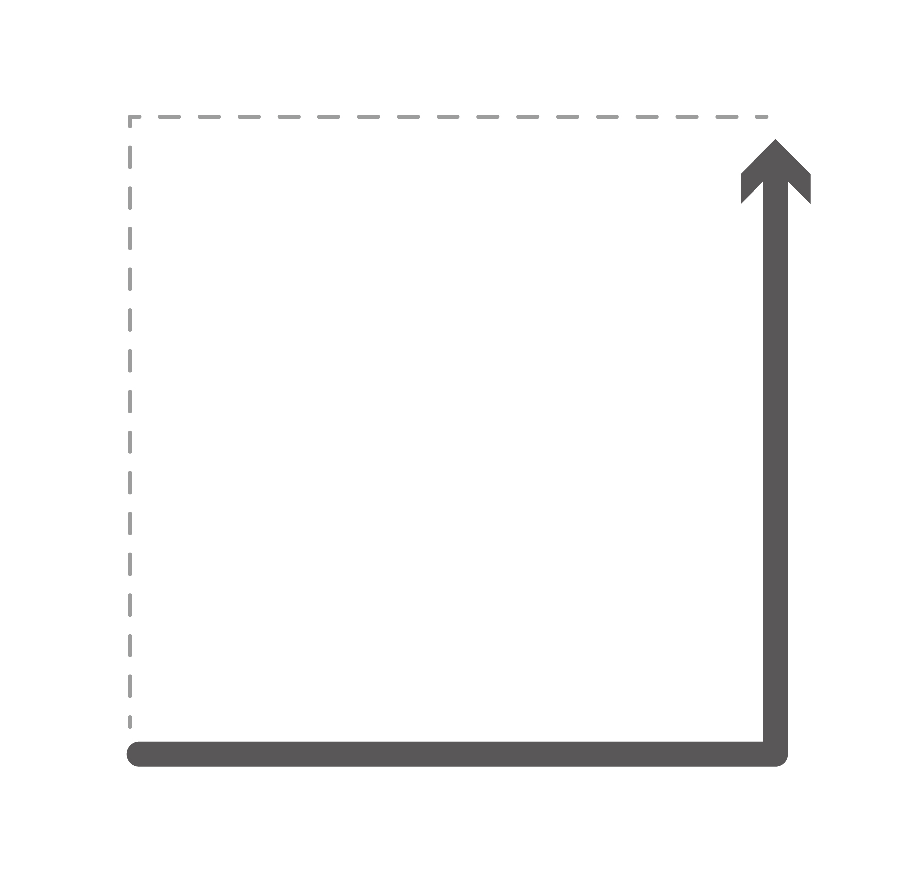

# Mathmatics - 수학 개념

**HaedalEducation Component images related Mathmatics - 수학 개념에 관련된 해달에듀 컴포넌트 이미지**

We provide component images related Mathmatics.

All image names have the following rules.

- `HaedalEducation_mathmatics_(image information)_(file number)`

수학 개념에 관련된 컴포넌트 이미지를 제공합니다.

모든 이미지 이름은 다음의 규칙을 가집니다.

- `HaedalEducation_mathmatics_(이미지 정보)_(번호)`

### Image List (이미지 한눈에 보기)

---

[HaedalEducation_mathmatics_number_0.jpg](./HaedalEducation_mathmatics_number_0.jpg)

[HaedalEducation_mathmatics_number_1.png](./HaedalEducation_mathmatics_number_1.png)

[HaedalEducation_mathmatics_number_2.jpg](./HaedalEducation_mathmatics_number_2.jpg)

[HaedalEducation_mathmatics_number_3.png](./HaedalEducation_mathmatics_number_3.png)

[HaedalEducation_mathmatics_number_4.jpg](./HaedalEducation_mathmatics_number_4.jpg)

[HaedalEducation_mathmatics_number_5.png](./HaedalEducation_mathmatics_number_5.png)

[HaedalEducation_mathmatics_number_6.jpg](./HaedalEducation_mathmatics_number_6.jpg)

[HaedalEducation_mathmatics_number_7.png](./HaedalEducation_mathmatics_number_7.png)

[HaedalEducation_mathmatics_number_8.jpg](./HaedalEducation_mathmatics_number_8.jpg)

[HaedalEducation_mathmatics_rectangle_0.jpg](./HaedalEducation_mathmatics_rectangle_0.jpg)

[HaedalEducation_mathmatics_square_0.jpg](./HaedalEducation_mathmatics_square_0.jpg)

[HaedalEducation_mathmatics_square_1.jpg](./HaedalEducation_mathmatics_square_1.jpg)

[HaedalEducation_mathmatics_square_2.jpg](./HaedalEducation_mathmatics_square_2.jpg)

[HaedalEducation_mathmatics_square_3.jpg](./HaedalEducation_mathmatics_square_3.jpg)

[HaedalEducation_mathmatics_square_4.jpg](./HaedalEducation_mathmatics_square_4.jpg)

[HaedalEducation_mathmatics_triangle_0.jpg](./HaedalEducation_mathmatics_triangle_0.jpg)

[HaedalEducation_mathmatics_tangram_0.jpg](./HaedalEducation_mathmatics_tangram_0.jpg)

[HaedalEducation_mathmatics_thinking_0.png](./HaedalEducation_mathmatics_thinking_0.png)

---

### Using HaedalFriends

[HaedalFriends Opensource Guide](../../README.md)

[해달프렌즈 오픈소스 가이드](../../README.md)
