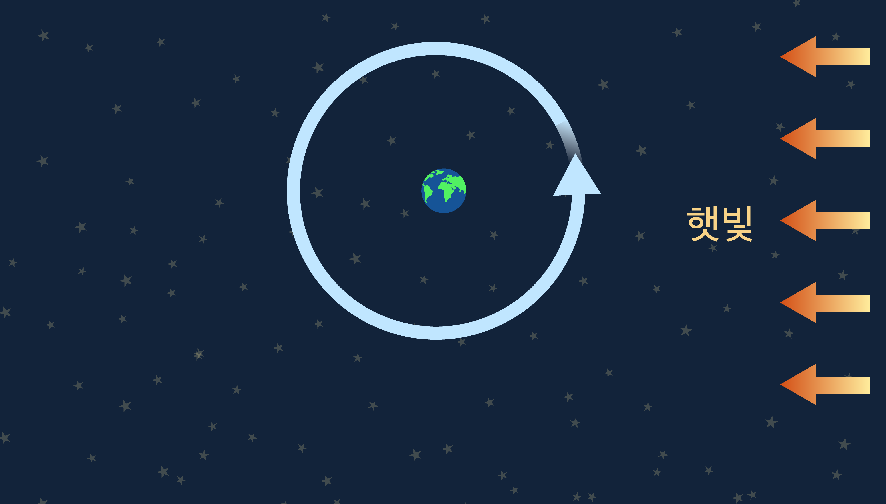

# Science -과학 개념(전자/전기 제외)

**HaedalEducation Component images related Science - 과학 개념(전자/전기 제외)에 관련된 해달에듀 컴포넌트 이미지**

We provide component images related Science.

All image names have the following rules.

- `HaedalEducation_science_(image information)_(file number)`

과학 개념(전자/전기 제외)에 관련된 컴포넌트 이미지를 제공합니다.

모든 이미지 이름은 다음의 규칙을 가집니다.

- `HaedalEducation_science_(이미지 정보)_(번호)`

### Image List (이미지 한눈에 보기)

---

[HaedalEducation_science_calculate_0.jpg](./HaedalEducation_science_calculate_0.jpg)

[HaedalEducation_science_calculate_1.jpg](./HaedalEducation_science_calculate_1.jpg)

[HaedalEducation_science_communication_0.jpg](./HaedalEducation_science_communication_0.jpg)

[HaedalEducation_science_communication_1.jpg](./HaedalEducation_science_communication_1.jpg)

[HaedalEducation_science_digestivesystem_0.png](./HaedalEducation_science_digestivesystem_0.png)

[HaedalEducation_science_echo_0.jpg](./HaedalEducation_science_echo_0.jpg)

[HaedalEducation_science_echo_1.png](./HaedalEducation_science_echo_1.png)

[HaedalEducation_science_elasticforce_0.png](./HaedalEducation_science_elasticforce_0.png)

[HaedalEducation_science_food_0.png](./HaedalEducation_science_food_0.png)

[HaedalEducation_science_food_1.png](./HaedalEducation_science_food_1.png)

[HaedalEducation_science_frictionalforce_0.png](./HaedalEducation_science_frictionalforce_0.png)

[HaedalEducation_science_frictionalforce_1.png](./HaedalEducation_science_frictionalforce_1.png)

[HaedalEducation_science_hottub_0.jpg](./HaedalEducation_science_hottub_0.jpg)

[HaedalEducation_science_light_0.jpg](./HaedalEducation_science_light_0.jpg)

[HaedalEducation_science_moonphases_0.jpg](./HaedalEducation_science_moonphases_0.jpg)

[HaedalEducation_science_moonphases_1.jpg](./HaedalEducation_science_moonphases_1.jpg)

[HaedalEducation_science_photosynthesis_0.jpg](./HaedalEducation_science_photosynthesis_0.jpg)

[HaedalEducation_science_photosynthesis_1.jpg](./HaedalEducation_science_photosynthesis_1.jpg)

[HaedalEducation_science_plantenergycycle_0.jpg](./HaedalEducation_science_plantenergycycle_0.jpg)

[HaedalEducation_science_rockcycle_0.jpg](./HaedalEducation_science_rockcycle_0.jpg)

[HaedalEducation_science_satelliteexplosion_0.jpg](./HaedalEducation_science_satelliteexplosion_0.jpg)

[HaedalEducation_science_satelliteexplosion_1.png](./HaedalEducation_science_satelliteexplosion_1.png)

[HaedalEducation_science_seashore_0.jpg](./HaedalEducation_science_seashore_0.jpg)

[HaedalEducation_science_space_0.png](./HaedalEducation_science_space_0.png)

[HaedalEducation_science_speed_0.png](./HaedalEducation_science_speed_0.png)

[HaedalEducation_science_speed_1.png](./HaedalEducation_science_speed_1.png)

[HaedalEducation_science_thermometer_0.png](./HaedalEducation_science_thermometer_0.png)

[HaedalEducation_science_thermometer_1.jpg](./HaedalEducation_science_thermometer_1.jpg)

[HaedalEducation_science_watercycle_0.jpg](./HaedalEducation_science_watercycle_0.jpg)

[HaedalEducation_science_watersound_0.jpg](./HaedalEducation_science_watersound_0.jpg)

[HaedalEducation_science_watersound_1.png](./HaedalEducation_science_watersound_1.png)

[HaedalEducation_science_wearable_0.jpg](./HaedalEducation_science_wearable_0.jpg)

[HaedalEducation_science_weatherforecast_0.jpg](./HaedalEducation_science_weatherforecast_0.jpg)

---

### Using HaedalFriends

[HaedalFriends Opensource Guide](../../README.md)

[해달프렌즈 오픈소스 가이드](../../README.md)
