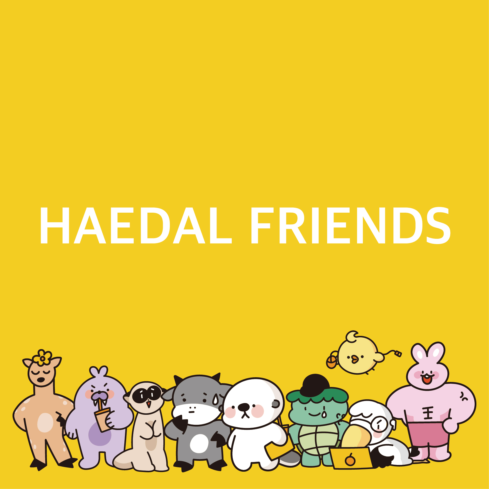
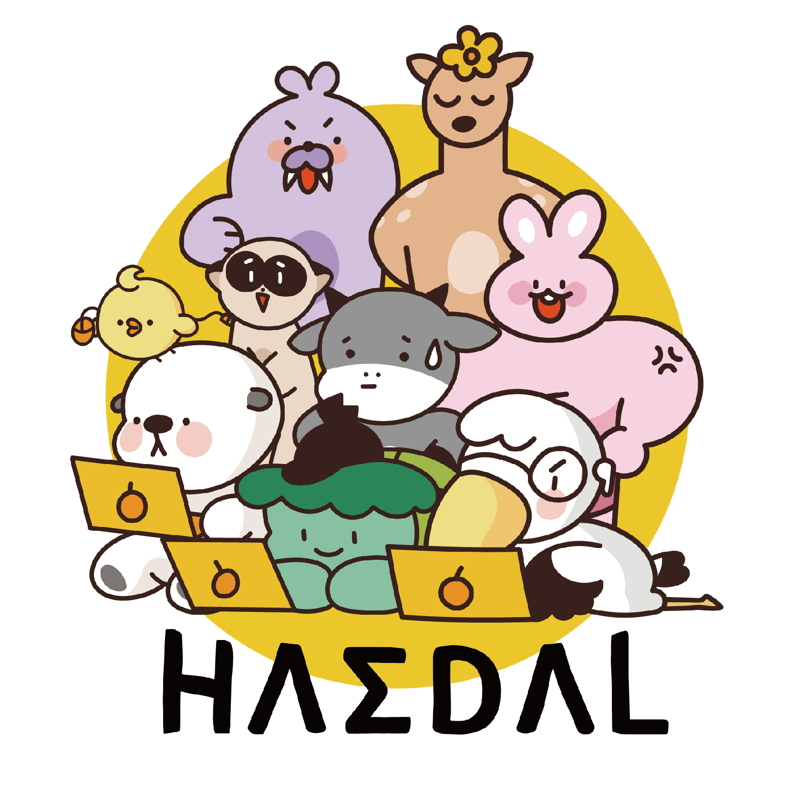
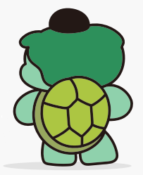

# HaedalFriends

**Haedalfriends character Folder Guide - 해달프렌즈 캐릭터 폴더 사용법**

We provide an image of the HaedalFriends character.

All image names have the following rules.

- `HaedalFriends_(character name)_(characteristic)_(file number)`

해달프렌즈 캐릭터 이미지를 제공합니다.

모든 이미지 이름은 다음의 규칙을 가집니다.

- `HaedalFriends_캐릭터명_특징_번호`

### Image List (이미지 한눈에 보기)

---

[HaedalFriends_all_basic_0.jpeg](./HaedalFriends_all_basic_0.jpeg)

[HaedalFriends_all_basic_1.jpeg](./HaedalFriends_all_basic_1.jpeg)

---

[HaedalFriends_haedali_basic_0.png](./HaedalFriends_haedali_basic_0.png)

[HaedalFriends_haedali_basic_1.png](./HaedalFriends_haedali_basic_1.png)

[HaedalFriends_haedali_basic_2.png](./HaedalFriends_haedali_basic_2.png)

[HaedalFriends_haedali_front_0.png](./HaedalFriends_haedali_front_0.png)

[HaedalFriends_haedali_front_1.png](./HaedalFriends_haedali_front_1.png)

[HaedalFriends_haedali_front_2.png](./HaedalFriends_haedali_front_2.png)

[HaedalFriends_haedali_front_3.png](./HaedalFriends_haedali_front_3.png)

[HaedalFriends_haedali_back_0.png](./HaedalFriends_haedali_back_0.png)

[HaedalFriends_haedali_back_1.png](./HaedalFriends_haedali_back_1.png)

[HaedalFriends_haedali_back_2.png](./HaedalFriends_haedali_back_2.png)

[HaedalFriends_haedali_left_0.png](./HaedalFriends_haedali_left_0.png)

[HaedalFriends_haedali_left_1.png](./HaedalFriends_haedali_left_1.png)

[HaedalFriends_haedali_dance_0.png](./HaedalFriends_haedali_dance_0.png)

[HaedalFriends_haedali_dance_1.png](./HaedalFriends_haedali_dance_1.png)

[HaedalFriends_haedali_eat_0.png](./HaedalFriends_haedali_eat_0.png)

[HaedalFriends_haedali_eat_1.png](./HaedalFriends_haedali_eat_1.png)

[HaedalFriends_haedali_walk_0.png](./HaedalFriends_haedali_left_0.png)

---

[HaedalFriends_hugyu_basic_0.png](./HaedalFriends_hugyu_basic_0.png)

[HaedalFriends_hugyu_basic_1.png](./HaedalFriends_hugyu_basic_1.png)

[HaedalFriends_hugyu_back_0.png](./HaedalFriends_hugyu_back_0.png)

[HaedalFriends_hugyu_back_1.png](./HaedalFriends_hugyu_back_1.png)

[HaedalFriends_hugyu_left_0.png](./HaedalFriends_hugyu_left_0.png)

---

[HaedalFriends_sasumi_basic_0.png](./HaedalFriends_sasumi_basic_0.png)

[HaedalFriends_sasumi_basic_1.png](./HaedalFriends_sasumi_basic_1.png)

[HaedalFriends_sasumi_back_0.png](./HaedalFriends_sasumi_back_0.png)

[HaedalFriends_sasumi_back_1.png](./HaedalFriends_sasumi_back_1.png)

[HaedalFriends_sasumi_left_0.png](./HaedalFriends_sasumi_left_0.png)

---

[HaedalFriends_ari_basic_0.png](./HaedalFriends_ari_basic_0.png)

[HaedalFriends_ari_basic_1.png](./HaedalFriends_ari_basic_1.png)

[HaedalFriends_ari_back_0.png](./HaedalFriends_ari_back_0.png)

[HaedalFriends_ari_back_1.png](./HaedalFriends_ari_back_1.png)

[HaedalFriends_ari_left_0.png](./HaedalFriends_ari_left_0.png)

---

[HaedalFriends_doogeunkim_basic_0.png](./HaedalFriends_doogeunkim_basic_0.png)

[HaedalFriends_doogeunkim_basic_1.png](./HaedalFriends_doogeunkim_basic_1.png)

[HaedalFriends_doogeunkim_back_0.png](./HaedalFriends_doogeunkim_back_0.png)

[HaedalFriends_doogeunkim_back_1.png](./HaedalFriends_doogeunkim_back_1.png)

[HaedalFriends_doogeunkim_left_0.png](./HaedalFriends_doogeunkim_left_0.png)

---

[HaedalFriends_maggiecarl_basic_0.png](./HaedalFriends_maggiecarl_basic_0.png)

[HaedalFriends_maggiecarl_basic_1.png](./HaedalFriends_maggiecarl_basic_1.png)

[HaedalFriends_maggiecarl_back_0.png](./HaedalFriends_maggiecarl_back_0.png)

[HaedalFriends_maggiecarl_back_1.png](./HaedalFriends_v_back_1.png)

[HaedalFriends_maggiecarl_left_0.png](./HaedalFriends_maggiecarl_left_0.png)

[HaedalFriends_maggiecarl_walk_0.png](./HaedalFriends_maggiecarl_walk_0.png)

[HaedalFriends_maggiecarl_walk_1.png](./HaedalFriends_maggiecarl_walk_1.png)

---

[HaedalFriends_searayon_basic_0.png](./HaedalFriends_searayon_basic_0.png)

[HaedalFriends_searayon_basic_1.png](./HaedalFriends_searayon_basic_1.png)

[HaedalFriends_searayon_back_0.png](./HaedalFriends_searayon_back_0.png)

[HaedalFriends_searayon_back_1.png](./HaedalFriends_searayon_back_1.png)

[HaedalFriends_searayon_front_0.png](./HaedalFriends_searayon_front_0.png)

[HaedalFriends_searayon_left_0.png](./HaedalFriends_searayon_left_0.png)

---

[HaedalFriends_buggie_back_0.png](./HaedalFriends_buggie_back_0.png)

[HaedalFriends_buggie_back_1.png](./HaedalFriends_buggie_back_1.png)

[HaedalFriends_buggie_left_0.png](./HaedalFriends_buggie_left_0.png)

---

[HaedalFriends_supam_basic_0.png](./HaedalFriends_supam_basic_0.png)

[HaedalFriends_supam_basic_1.png](./HaedalFriends_supam_basic_1.png)

[HaedalFriends_supam_back_0.png](./HaedalFriends_supam_back_0.png)

[HaedalFriends_supam_back_1.png](./HaedalFriends_supam_back_1.png)

[HaedalFriends_supam_walk_0.png](./HaedalFriends_supam_walk_0.png)

[HaedalFriends_supam_walk_1.png](./HaedalFriends_supam_walk_1.png)

---

### Using HaedalFriends

[HaedalFriends Opensource Guide](../README.md)

[해달프렌즈 오픈소스 가이드](../README.md)
