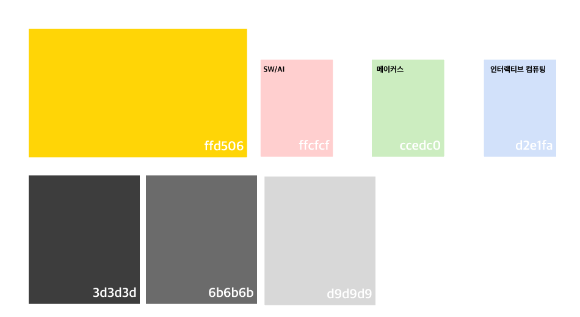
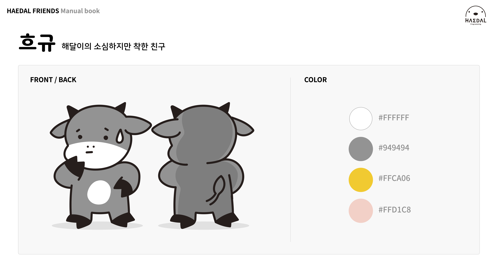

# Manual

**Haedalfriends Manual Folder Guide - 매뉴얼 폴더 사용법**

We provide an introductory image of the HaedalFriends character.

All image names have the following rules.

- `Manual_(character name)_infor_(file number)`

해달프렌즈 캐릭터에 대한 소개 이미지를 제공합니다.

모든 이미지 이름은 다음의 규칙을 가집니다.

- `Manual_캐릭터명_infor_번호`

### Image List (이미지 한눈에 보기)

---

[Manual_all_infor_0.jpg](./Manual_all_infor_0.jpg)

[Manual_all_infor_1.jpeg](./Manual_all_infor_1.jpeg)

[Manual_all_infor_2.jpeg](./Manual_all_infor_2.jpeg)

[Manual_all_infor_3.jpeg](./Manual_all_infor_3.jpeg)

[Manual_all_infor_4.jpeg](./Manual_all_infor_4.jpeg)

[Manual_all_infor_5.jpeg](./Manual_all_infor_5.jpeg)

[Manual_all_infor_6.jpeg](./Manual_all_infor_6.jpeg)

[Manual_all_infor_7.jpeg](./Manual_all_infor_7.jpeg)

[Manual_all_infor_8.jpeg](./Manual_all_infor_8.jpeg)

[Manual_all_infor_9.jpeg](./Manual_all_infor_9.jpeg)

[Manual_all_infor_10.jpeg](./Manual_all_infor_10.jpeg)

[Manual_all_infor_11.jpeg](./Manual_all_infor_11.jpeg)

[Manual_all_infor_12.jpeg](./Manual_all_infor_12.jpeg)

[Manual_all_infor_13.jpeg](./Manual_all_infor_13.jpeg)

[Manual_all_infor_14.jpeg](./Manual_all_infor_14.jpeg)

[Manual_all_infor_15.jpeg](./Manual_all_infor_15.jpeg)

[Manual_all_infor_16.jpeg](./Manual_all_infor_16.jpeg)

---

[Manual_all_label_0.png](./Manual_all_label_0.png)

[Manual_none_brandcolor_0.jpg](./Manual_none_brandcolor_0.png)

---

[Manual_ari_infor_0.jpg](./Manual_ari_infor_0.jpg)

[Manual_ari_infor_1.jpg](./Manual_ari_infor_1.jpg)

[Manual_ari_infor_2.jpeg](./Manual_ari_infor_2.jpeg)

---

[Manual_buggie_infor_0.jpg](./Manual_buggie_infor_0.jpg)

[Manual_buggie_infor_1.jpg](./Manual_buggie_infor_1.jpg)

[Manual_buggie_infor_2.jpeg](./Manual_buggie_infor_2.jpeg)

---

[Manual_doogeunkim_infor_0.jpg](./Manual_dooguenkim_infor_0.jpg)

[Manual_dooguenkim_infor_1.jpg](./Manual_dooguenkim_infor_1.jpg)

[Manual_dooguenkim_infor_2.jpeg](./Manual_dooguenkim_infor_2.jpeg)

---

[Manual_haedali_infor_0.jpg](./Manual_haedali_infor_0.jpg)

[Manual_haedali_infor_1.jpg](./Manual_haedali_infor_1.jpg)

[Manual_haedali_infor_2.jpeg](./Manual_haedali_infor_2.jpeg)

---

[Manual_hugyu_infor_0.jpg](./Manual_hugyu_infor_0.jpg)

[Manual_hugyu_infor_1.jpg](./Manual_hygyu_infor_1.jpg)

[Manual_hugyu_infor_2.jpeg](./Manual_hugyu_infor_2.jpeg)

---

[Manual_maggiecarl_infor_0.jpg](./Manual_maggiecarl_infor_0.jpg)

[Manual_maggiecarl_infor_1.jpg](./Manual_maggiecarl_infor_1.jpg)

[Manual_maggiecarl_infor_2.jpeg](./Manual_maggiecarl_infor_2.jpeg)

---

[Manual_sasumi_infor_0.jpg](./Manual_sasumi_infor_0.jpg)

[Manual_sasumi_infor_1.jpg](./Manual_sasumi_infor_1.jpg)

[Manual_sasumi_infor_2.jpeg](./Manual_sasumi_infor_2.jpeg)

---

[Manual_searayon_infor_0.jpg](./Manual_searayon_infor_0.jpg)

[Manual_searayon_infor_1.jpg](./Manual_searayon_infor_1.jpg)

[Manual_searayon_infor_2.jpeg](./Manual_searayon_infor_2.jpeg)

---

[Manual_supam_infor_0.jpg](./Manual_supam_infor_0.jpg)

[Manual_supam_infor_1.jpg](./Manual_supam_infor_1.jpg)

[Manual_supam_infor_2.jpeg](./Manual_supam_infor_2.jpeg)

---

### Using HaedalFriends

[HaedalFriends Opensource Guide](../README.md)

[해달프렌즈 오픈소스 가이드](../README.md)
