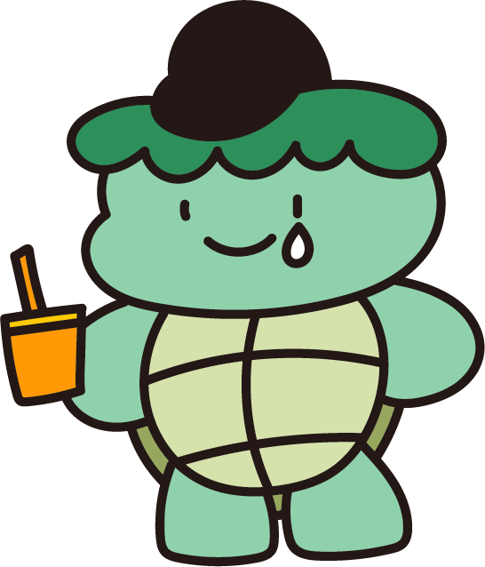

# We are HaedalFriends! 우리는 해달프렌즈입니다!

해달프렌즈는 해달에듀만의 고유 캐릭터입니다.

2020년 5월20일에 창작되어 같은해 12월 9일 저작권 등록을 마친 캐릭터입니다.

2024년 12월부터 다양한 모습의 캐릭터, 컴포넌트, 배경 이미지들을 오픈소스로 제공하고 있습니다.

## 전체

|  |  |  |
|:---:|:---:|:---:|
| 해달이 Haedali | 흐규 Hugyu | 사스미 Sasumi |
|  |  |  |
| 아리 Ari | 김두근 Doogeun Kim | 매기 Maggie Carl |
|  |  |  |
| 시라용 Siraryong | 부기 Boogie | 스팸 Spam |

# Character information 캐릭터 정보

### Haedali-해달이

**Mascot of Haedal Friends**

Currently studying at Haedal University with my fellow Haedal friends.  
With a downturned mouth and a poker face, Haedal might appear cold at first glance.  
However, with soft, squishy hands, Haedal helps many classmates with their coding and possesses a warm personality.  
Mainly found by the window on the second floor of a cafe near the campus, coding with a laptop resting on its belly, Haedal has become a famous sight at Haedal University.

**해달프렌즈의 마스코트**

해달대학교 IT대학에 해달즈 친구들과 함께 재학 중.  
내려간 입꼬리의 포커페이스 소유자로 언뜻 보면 차가울 것 같지만, 몰랑몰랑한 손으로 여러 학우들의 코딩을 도와주는 따뜻한 도시의 해달이다.  
주로 학교 근처의 카페 3층 창가에서 발견되며 배 위에 노트북을 올려 두고 코딩하는 모습이 IT대학교 명물이라고..?

---

### Hugyu-흐규

**Haedal's Shy but Kind Friend**

Studying at the IT College together with Haedal. 
A supreme introvert who starts worrying about bugs from the very beginning of project planning. 
Preparing for graduation with Haedal's help. Works the longest hours in the department, yet somehow always ends up with sad results. 
So exhausted from overnight work that sometimes passes by friends on the street without even recognizing them.

**해달이의 소심하지만 착한 친구**

해달이와 함께 IT대학에 재학 중. 
기획할 때부터 버그 걱정을 시작하는 소심소심 왕소심이다. 
해달이의 도움을 받아 열심히 졸업을 준비하고 있다고 한다. 
작업시간은 과내 탑이지만 어쩐지 결과물은 슬프기만한 친구. 
밤샘 작업을 하다 밖에서 친구를 만나도 못알아보고 지나가기도 한다.

---

### Sasumi-사스미

**A developer born with 48 hours in a day**

Blessed by the development languages, born as an who was a developer from birth. Sasumi is handsome animal in Haedal University. 
In the terminal stage of a prince syndrome, Sasumi has severe narcissism about coding skills.
Moreover, Sasumi's the most popular student in the Computer Science department.  
Sasumi's an overachiever who is the top score student in department, department representative, and misses no opportunity to enhance specs.
There's a rumor that Sasumi's always in the department room, admiring his own work.  
Sasumi's annoyingly attractive, but undeniably handsome - a too-much setting.

**사주팔자가 개발자에 하루가 48시간**

개발 언어의 가호를 받고 태어난, 사주팔자가 개발자인 IT대 존잘러.  
왕자병 말기에 코딩 나르시즘도 말기다. 거기다 인싸이기까지... 
과탑에 과대, 스펙까지 어느 것 하나 놓치지 않는 욕심쟁이이다. 
과방에서 늘 자신의 작업물들을 보며 감탄하고 있다는 소문이 있다. 
재수 없지만 부정할 수 없는 존잘이라는 투머치 설정

---

### Ari-아리

**A Cute Child in a Barren Engineering College**

The national freshman of the IT college 
Because ari doesn't yet know the ecosystem of the engineering college, ari is always clear-hearted and positive. 
Ari knows nothing, but because of that, ari is in the midst of a happy school life. 
The adorable student of the engineering college, whose specialty is three-stage combo programming using wings and beak.

**삭막한 공대 속 한줄기의 귀여움**

IT대학 교내의 국민 샌애긔 
아직 공대의 생태계를 모르기에 항상 해맑고 긍정적이다. 
아무 것도 모르지만 그렇기에 행복한 학교 생활 중이다. 
날개와 부리를 사용한 3단 콤보 프로그래밍이 특기인 공대의 귀염둥이

---

### Doogeun Kim-김두근

**An Innocent Face with huge Muscles**

The rabbit in charge of IT college's reversal charm
The very 'healthy developer' who exists only in imagination. 
A health rabbit who points out turtle neck and spine every time she meets friends. 
A friend who does exercise when coding does not work out well. 
Thanks to this, doogeun has apparently become an eight-pack owner as her academic year goes up. 
Because doogeun is a herbivore, muscles raised by earnestly eating only beans? 

**착한 얼굴에 그렇지 못한 끄뉵**

IT대학의 반전매력을 담당하는 토끼 
상상 속에만 존재한다는 바로 그 '건강한 개발자'이다. 
친구들을 만날 때 마다 거북목과 척추를 지적하곤 하는 건강토끼다. 
코딩이 잘 안 풀리면 어쩐지 운동을 하고 있는 친구. 
덕분에 학년이 올라갈수록 에잇팩의 소유자가 되어버렸다고 한다. 
초식 동물이기에 열심히 콩만 먹어서 키운 근육이라고?

---

### Maggie Carl-매기

**Has All the Latest IT Devices.**

The living legend of pre-order and the early adopter of IT college. 
He has a personality that must possess all new electronic devices and technologies. 
But there are somehow eyewitness accounts that he only does only mouth-coding...? 
It can be said that he almost has all newly released devices. 
By the way, his favorite snack is Shrimp Crackers. 

**최신 기기는 모두 그가 가지고 있다.**

사전 예약의 살아있는 전설이자 IT대학의 얼리어답터 
새로 나온 전자기기와 기술은 모두 가져야하는 성미를 가졌다.
하지만 어쩐지 입코딩만 한다는 주변의 목격담이 있기도...?
새로 나온 모든 기기는 거의 모두 가지고 있다고 할 수 있다.
여담이지만 제일 좋아하는 과자는 새우깡이라고

---

### Searayon-시라용

**After Returning to School, Already 500 Lattes**

Searayon, who says, "It wasn't like this before. Back in the day, this language was up to date" is a living Paleozoic fossil at the Haedal University. 
For some reason, Searayon have an obsession with old things, voluntarily walking the path of a lonely young rigid person in the IT department. 
There's a rumor that I actually always order an iced latte at cafes..."

**복학 후 라떼만 벌써 500잔 째**

라떼는 이렇게 안했어. 라떼는 이 언어가 최신이었어를 남발하는 IT대학의 살아있는 고생대 화석이다.
어쩐지 옛날 것에 집착하는 고집이 있어 IT대에서 외로운 젊은 꼰대의 길을 자처해 걷고 있는 포지션
실제로 카페에서 늘 아이스 라떼만 시킨다는 소문이..?

---

### Buggie-부기

**A Typical Turtle-Neck from the Haedal University**

A typical IT college student who worked so hard on the computer that they eventually developed a severe turtle-neck. 
Every day, they head to the department club room with a cap and coffee. 
It is a living legend of the turtle neck world, and it is said that it is possible to go directly to the sea thanks to the serious turtle neck. 
It is said that inside their shell, a precious MacBook is carried."

**IT대의 여느 평범한 거북목 말기**

너무 열심히 컴퓨터 작업을 하다 결국 거북목 말기가 되어버린 평범한 IT대학 학생.
매일 캡모자와 커피를 지참하고 과방으로 향한다.
심각한 거북목 덕에 바로 바다로 가면 될 것 같다는 거북목계의 살아있는 전설.
그의 등딱지 안에는 소중한 맥북이 들어있다고 한다.

---

### Spam-스팸

**Academic Passion That Only Ignites Near the End of Class**

Curious about everything from start to finish, but that doesn't mean studying. 
Possessing tremendous academic passion, but it only erupts precisely 10 minutes before the end of class. 
A really good friend... who asks questions about everything from start to finish. 
The phrases most frequently spoken are 'Why is this so?', 'Why isn't this like that?'"

**수업이 끝날 쯤에만 불타오르는 학구열**

하나부터 열까지 궁금하지만, 그게 공부하겠다는 뜻은 아니죠.
엄청난 학구열을 가지고 있지만 그것이 꼭 수업의 마지막에만, 측히 수업 마무리 10분 전에 솟구쳐 오르는 스타일.
정말 좋은 친구지만 하나부터 열까지 다 물어보는 편이다.
제일 많이 하는 말은 "이건 웨 그레요?","이건 웨 안대요?"

# Folder information - 폴더 정보

### Manual-해달프렌즈 캐릭터 매뉴얼

- We provide an introductory image of the HaedalFriends character.

- 해달프렌즈 캐릭터에 대한 소개 이미지를 제공합니다.

    - [Click to see Haedalfriends Manual Folder images](Manual), [해달프렌즈 매뉴얼 이미지 보러가기](Manual)

    - [Haedalfriends Manual Folder Guide](Manual/README.md), [매뉴얼 폴더 사용법](Manual/README.md)

### HaedalFriends-해달프렌즈 캐릭터

- We provide an image of the HaedalFriends character.

- 해달프렌즈 캐릭터 이미지를 제공합니다.

    - [Click to see Haedalfriends character images](HaedalFriends), [해달프렌즈 캐릭터 이미지 보러가기](HaedalFriends)

    - [Haedalfriends character Folder Guide](HaedalFriends/README.md), [해달프렌즈 캐릭터 폴더 사용법](HaedalFriends/README.md)

### Utilization-변형된 해달프렌즈

- We provide an image of the utilized HaedalFriends character.

- 변형된 해달프렌즈 캐릭터 이미지를 제공합니다.

    - [Click to see utilized Haedalfriends character images](Utilization), [변형된 해달프렌즈 캐릭터 이미지 보러가기](Utilization)

    - [Utilized Haedalfriends character Folder Guide](Utilization/README.md), [변형된 해달프렌즈 캐릭터 폴더 사용법](Utilization/README.md)

### Christmas-해달프렌즈 크리스마스 캐릭터

- We provide an Christmas version of Haedalfriends character images.

- 해달프렌즈 캐릭터의 크리스마스 버전 이미지를 제공합니다.

    - [Click to see Haedalfriends Christmas character images](Christmas), [해달프렌즈 크리스마스 캐릭터 이미지 보러가기](Christmas)

    - [Haedalfriends Christmas character Folder Guide](Christmas/README.md), [해달프렌즈 크리스마스 캐릭터 폴더 사용법](Christmas/README.md)

### Halloween-해달프렌즈 할로윈 캐릭터

- We provide an Halloween version of Haedalfriends character images.

- 해달프렌즈 캐릭터의 할로윈 버전 이미지를 제공합니다.

    - [Click to see Haedalfriends Halloween character images](Halloween), [해달프렌즈 할로윈 캐릭터 이미지 보러가기](Halloween)

    - [Haedalfriends Halloween character Folder Guide](Halloween/README.md), [해달프렌즈 할로윈 캐릭터 폴더 사용법](Halloween/README.md)

### HaedalEducation-해달에듀 컴포넌트

- We provide component images used in HaedalEdu.

- 해달에듀에서 사용하는 컴포넌트를 제공합니다.

    - [Click to see HaedalEducation Component images](HaedalEducation), [해달에듀 컴포넌트 이미지 보러가기](HaedalEducation)

    - [HaedalEducation Component Folder Guide](HaedalEducation/README.md), [해달에듀 컴포넌트 폴더 사용법](HaedalEducation/README.md)
        - [hardware-하드웨어(전자/ 전기)](./HARDWARE.md)
        - [software-소프트웨어(코딩)](./SOFTWARE.md)
        - [mathmatics-수학 개념](./MATHMATICS.md)
        - [science-과학 개념(전자/전기 제외)](./SCIENCE.md)
        - [social-일상생활](./SOCIAL.md)
        - [etc-기타](./ETC.md)

### Background-배경 이미지

- We provide an background images.

- 배경 이미지를 제공합니다.

    - [Click to see Background images](Background), [배경 이미지 보러가기](Background)

    - [Background Folder Guide](Background/README.md), [배경 이미지 폴더 사용법](Background/README.md)

## Licenses-라이센스

1. [English Licenses](characterLicense_en.md)
2. [Korean Licenses](characterLicense_kr.md)

## Do you want to be contributor?-나만의 해달프렌즈 이미지를 갖고 계신가요?

Please contribute to HaedalFriends!

Create issue with image name / image file(.svg) in this repository.

We will look at the images of the issue you have created and try to contribute to HaedalFriends through feedback!

해달프렌즈에 기여해주세요!

이미지 이름 / 이미지 파일(.svg)로 현재 레포지토리에 이슈를 작성해주세요.

생성하신 이슈의 이미지를 검토하고, 피드백을 통해 해달프렌즈 캐릭터에 기여할 수 있도록 노력하겠습니다.
