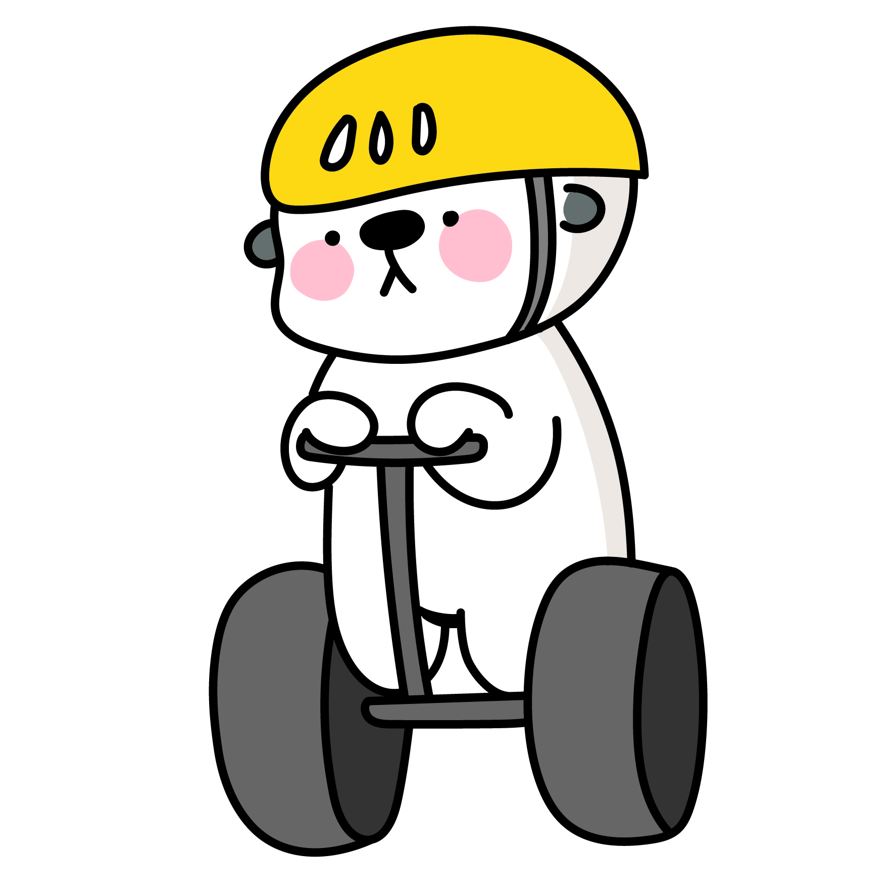
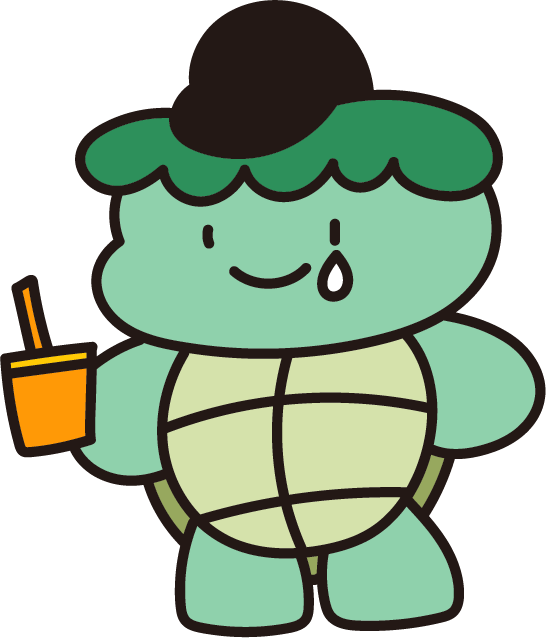

# Utilization

**Utilized Haedalfriends character Folder Guide - 변형된 해달프렌즈 캐릭터 폴더 사용법**

We provide an image of the utilized HaedalFriends character.

All image names have the following rules.

- `Utilization_(character name)_(characteristic)_(file number)`

변형된 해달프렌즈 캐릭터 이미지를 제공합니다.

모든 이미지 이름은 다음의 규칙을 가집니다.

- `Utilization_캐릭터명_특징_번호`

### Image List (이미지 한눈에 보기)

---

[Utilization_haedali_angry_0.png](./Utilization_haedali_angry_0.png)

[Utilization_haedali_armor_0.png](./Utilization_haedali_armor_0.png)

[Utilization_haedali_cook_0.jpeg](./Utilization_haedali_cook_0.jpeg)

[Utilization_haedali_flag_0.png](./Utilization_haedali_flag_0.png)

[Utilization_haedali_flag_1.png](./Utilization_haedali_flag_1.png)

[Utilization_haedali_flag_2.png](./Utilization_haedali_flag_2.png)

[Utilization_haedali_flag_3.png](./Utilization_haedali_flag_3.png)

[Utilization_haedali_front_0.jpeg](./Utilization_haedali_front_0.jpeg)

[Utilization_haedali_game_0.jpg](./Utilization_haedali_game_0.jpg)

[Utilization_haedali_lie_0,jpeg](./Utilization_haedali_lie_0.jpeg)

[Utilization_haedali_lie_1.png](./Utilization_haedali_lie_1.png)

[Utilization_haedali_lighting_0.jpg](./Utilization_haedali_lighting_0.jpg)

[Utilization_haedali_play_0.jpeg](./Utilization_haedali_play_0.jpeg)

[Utilization_haedali_ratfireworks_0.png](./Utilization_haedali_ratfireworks_0.png)

[Utilization_haedali_ratfireworks_1.png](./Utilization_haedali_ratfireworks_1.png)

[Utilization_haedali_ratfireworks_2.png](./Utilization_haedali_ratfireworks_2.png)

[Utilization_haedali_ratfireworks_3.png](./Utilization_haedali_ratfireworks_3.png)

[Utilization_haedali_water_0.png](./Utilization_haedali_water_0.png)

[Utilization_haedali_lava_0.png](./Utilization_haedali_lava_0.png)

[Utilization_haedali_soil_0.png](./Utilization_haedali_soil_0.png)

[Utilization_haedali_rock_0.png](./Utilization_haedali_rock_0.png)

[Utilization_haedali_rock_1.png](./Utilization_haedali_rock_1.png)

[Utilization_haedali_rock_2.png](./Utilization_haedali_rock_2.png)

[Utilization_haedali_sad_0.png](./Utilization_haedali_sad_0.png)

[Utilization_haedali_segway_0,jpg](./Utilization_haedali_segway_0.jpg)

[Utilization_haedali_smile_0.png](./Utilization_haedali_smile_0.png)

[Utilization_haedali_study_0.png](./Utilization_haedali_study_0.png)

[Utilization_haedali_study_1.png](./Utilization_haedali_study_1.png)

[Utilization_haedali_swim_0,jpeg](./Utilization_haedali_swim_0.jpeg)

[Utilization_haedali_swim_1.png](./Utilization_haedali_swim_1.png)

[Utilization_haedali_swim_2.png](./Utilization_haedali_swim_2.png)

[Utilization_haedali_swim_3.png](./Utilization_haedali_swim_3.png)

[Utilization_haedali_swim_4.png](./Utilization_haedali_swim_4.png)

[Utilization_haedali_umbrella_0.png](./Utilization_haedali_umbrella_0.png)

[Utilization_haedali_VR_0.png](./Utilization_haedali_VR_0.jpg)

[Utilization_haedali_polarbear_0.png](./Utilization_haedali_polarbear_0.png)

---

[Utilization_hugyu_sad_0.png](./Utilization_hugyu_sad_0.png)

[Utilization_hugyu_sad_1.png](./Utilization_hugyu_sad_1.png)

---

[Utilization_sasumi_drink_0.png](./Utilization_sasumi_drink_0.png)

[Utilization_sasumi_drink_1.png](./Utilization_sasumi_drink_1.png)

---

[Utilization_ari_sick_0.png](./Utilization_ari_sick_0.png)

[Utilization_ari_sleep_0.png](./Utilization_ari_sick_0.png)

[Utilization_ari_sleep_1.png](./Utilization_ari_sick_1.png)

[Utilization_ari_sleep_2.png](./Utilization_ari_sick_2.png)

---

[Utilization_doogeunkim_exercise_0.png](./Utilization_doogeunkim_exercise_0.png)

[Utilization_doogeunkim_exercise_1.png](./Utilization_doogeunkim_exercise_1.png)

[Utilization_doogeunkim_exercise_2.png](./Utilization_doogeunkim_exercise_2.png)

---

[Utilization_maggiecarl_study_0.png](./Utilization_maggiecarl_study_0.png)

[Utilization_maggiecarl_study_1.png](./Utilization_maggiecarl_study_1.png)

---

[Utilization_searayon_diving_0.png](./Utilization_searayon_diving_0.png)

[Utilization_searayon_diving_1.png](./Utilization_searayon_diving_1.png)

[Utilization_searayon_dress_0.png](./Utilization_searayon_dress_0.png)

[Utilization_searayon_drink_0.png](./Utilization_searayon_drink_0.png)

[Utilization_searayon_drink_1.png](./Utilization_searayon_drink_1.png)

[Utilization_searayon_parachute_0.png](./Utilization_searayon_parachute_0.png)

[Utilization_searayon_parachute_1.png](./Utilization_searayon_parachute_1.png)

[Utilization_searayon_thief_0.png](./Utilization_searayon_thief_0.png)

[Utilization_searayon_water_0.png](./Utilization_searayon_water_0.png)

---

[Utilization_buggie_drink_0.png](./Utilization_buggie_drink_0.png)

[Utilization_buggie_drink_1.png](./Utilization_buggie_drink_1.png)

[Utilization_buggie_front_0.jpeg](./Utilization_buggie_front_0.jpeg)

[Utilization_buggie_study_0.png](./Utilization_buggie_study_0.png)

[Utilization_buggie_study_1.png](./Utilization_buggie_study_1.png)

---

[Utilization_supam_left_0.png](./Utilization_supam_left_0.png)

[Utilization_supam_walk_0.png](./Utilization_supam_walk_0.png)

[Utilization_supam_walk_1.png](./Utilization_supam_walk_1.png)

[Utilization_supam_walk_2.png](./Utilization_supam_walk_2.png)

[Utilization_supam_walk_3.png](./Utilization_supam_walk_3.png)

### Using HaedalFriends

[HaedalFriends Opensource Guide](../README.md)

[해달프렌즈 오픈소스 가이드](../README.md)
